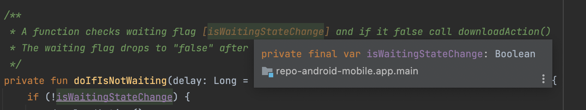
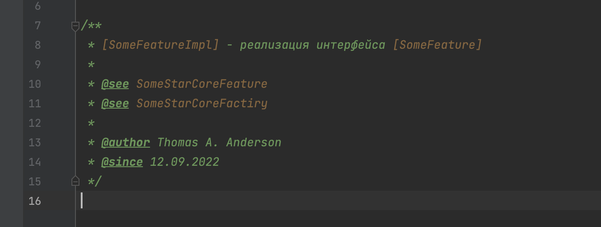
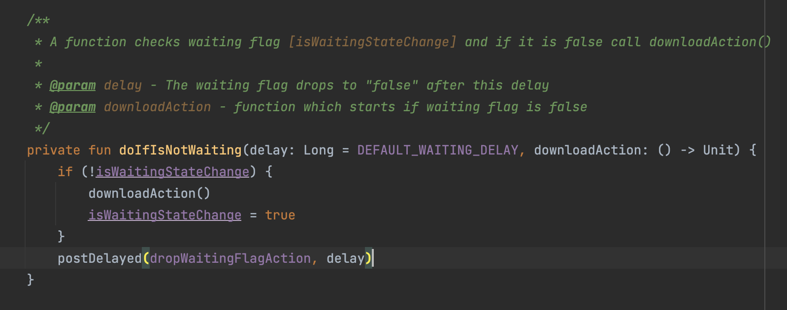

# Start-android-mobile гайд по ведению документации с помощью Kdoc

## Зачем
Kdoc позволит не только добавлять описание файла или метода, но также:
- Указывать параметры класса / функции и позволять ходить по ним, нажимая непосредственно на название упомянутого параметра / класса
- При наводе курсора на метод в коде увидеть доку к нему

- видеть ссылки на переменные


## Подробнее про Kdok:
- https://kotlinlang.org/docs/kotlin-doc.html

## Договоренности

- Комментарии пишем на **английском** (или на русском??? я за русский)

- Описание классов/методов обязательно и должно подчиняться следующему шаблону:
    - Для классов:
  ```
  /**
   * [SomeStarFeatureImpl] - реализация интерфейса [SomeStarFeature]
   *
   * @see SomeStarCoreFeature
   * @see SomeStarCoreFactiry
   * 
   * @author Thomas A. Anderson
   * @since 12.09.2022
   */
  ```
  Пример:
  

    - Для методов:
  ```
    /**
     * A function checks waiting flag [isWaitingStateChange] and if it is false call downloadAction()
     *
     * @param delay - The waiting flag drops to "false" after this delay
     * @param downloadAction - function which starts if waiting flag is false
     */
    private fun doIfIsNotWaiting(delay: Long = DEFAULT_WAITING_DELAY, downloadAction: () -> Unit) {
        if (!isWaitingStateChange) {
            downloadAction()
            isWaitingStateChange = true
        }
        postDelayed(dropWaitingFlagAction, delay)
    }
  ```
  Пример:
